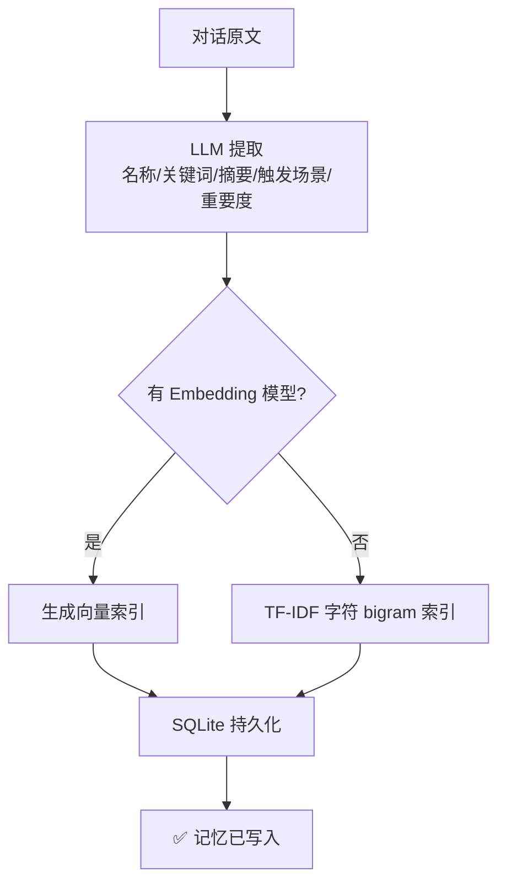
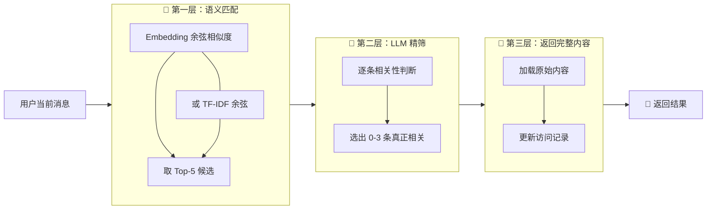
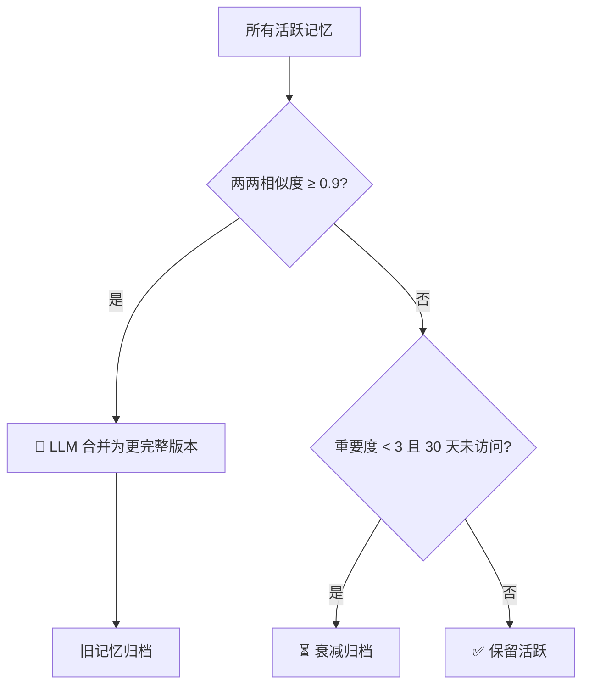

<div align="center">


# 🧠 Agent Memory Enhance

### 让 AI Agent 终于"记住你"。

**3 分钟接入，任何 MCP 客户端立刻拥有跨会话长期记忆——告别"金鱼脑"。**

[](LICENSE)
[](https://www.python.org/)
[](https://modelcontextprotocol.io/)
[](https://github.com/asf9sf/agent-memory-enhance-skill/stargazers)
[](https://github.com/asf9sf/agent-memory-enhance-skill/issues)

</div>

---

## 🎯 灵魂拷问：你的 AI 记得你昨天说了什么吗？

Claude、Cursor、TRAE、Windsurf……这些 AI 工具很强，但每次对话都是一张白纸。

> 还在为**上下文太长、token 烧钱**而烦恼吗？
> 还在为**每次都要重新介绍项目背景**而抓狂吗？
> 还在为**Agent 一觉醒来就"失忆"**而崩溃吗？
> 还在为**关键决策忘了为什么这么做**而翻 git log 到眼花吗？

你反复解释、重复偏好、一遍遍交代上下文——**不是你啰嗦，是 AI 没记忆。**

**Agent Memory Enhance** 把这个能力补上。一行命令接入，你的 Agent 立刻拥有：

- 📌 **结构化长期记忆** —— 跨会话、跨项目，永不遗忘
- 🔍 **三层漏斗检索** —— 精准命中，毫秒级响应
- 🧩 **自我维护** —— 自动合并相似记忆，自动遗忘过期信息
- 🔌 **即插即用** —— SQLite 零配置，兼容所有 MCP 客户端

---

## ✨ 核心能力

| 能力 | 别的 Agent | 装上记忆后 |
|------|-----------|----------|
| 记住用户偏好 | ❌ 每次重新说 | ✅ 自动持久化 |
| 跨会话上下文 | ❌ 上下文窗口一满就忘 | ✅ 长期存储，按需召回 |
| 项目历史决策 | ❌ 依赖 git log | ✅ 语义检索秒找 |
| 自动清理冗余 | ❌ 越积越多 | ✅ 自动合并 + 衰减遗忘 |
| 隐私 & 成本 | ❌ 全量上下文上传云端 | ✅ 本地存储 + 按需召回 |

### 🏗️ 结构化记忆对象

每条记忆不是一坨原文，而是一个**结构化对象**：

```json
{
  "name": "用户偏好：TTS 引擎选择",
  "keywords": ["tts", "sherpa-onnx", "cpu推理"],
  "summary": "用户要求 TTS 必须 CPU 离线，Sherpa-ONNX 为主引擎",
  "triggers": ["tts选型", "语音模块", "音频引擎"],
  "importance": 5,
  "raw_content": "<完整对话原文>"
}
```

LLM 提取 → 向量索引 → 按需召回 → **省 token、省时间、省心**。

---

## 🎬 效果演示

<div align="center">

| 接入前：每次都是"初次见面" | 接入后：跨会话记得一切 |
|:---:|:---:|
| ```User: 我用 PyQt5 做桌面应用```<br/>```AI: 好的，PyQt5 是...```<br/>```(下次对话)```<br/>```User: 帮我加 TTS```<br/>```AI: 好的，请问你的技术栈?``` | ```User: 帮我加 TTS```<br/>```AI: 检索到记忆：你用 PyQt5 桌面应用，```<br/>```    偏好 CPU 离线方案，Sherpa-ONNX 为主引擎。```<br/>```    我建议这样集成...`` |

</div>

---

## 🚀 快速开始

### 1. 安装

```bash
pip install agent-memory-enhance
```

或者从源码：

```bash
git clone https://github.com/asf9sf/agent-memory-enhance-skill.git
cd agent-memory-enhance-skill
pip install -e .
```

### 2. 配置（开箱即用，全可选）

所有参数走环境变量，**不配也能跑**：

| 环境变量 | 默认值 | 说明 |
|----------|--------|------|
| `MEMORY_LLM_BASE_URL` | `http://localhost:1234/v1` | OpenAI 兼容 API 地址 |
| `MEMORY_LLM_API_KEY` | `no-key` | API 密钥 |
| `MEMORY_LLM_MODEL` | `local-model` | LLM 模型名称 |
| `MEMORY_EMBEDDING_MODEL` | `""`（空 = TF-IDF） | Embedding 模型，留空自动回退 |
| `MEMORY_DB_PATH` | `./memory.db` | SQLite 数据库路径 |
| `MEMORY_LLM_TIMEOUT` | `30` | LLM 请求超时（秒） |

```bash
# 例：用本地 Ollama 跑 Qwen2.5:7b
set MEMORY_LLM_BASE_URL=http://localhost:1234/v1
set MEMORY_LLM_MODEL=qwen2.5:7b
set MEMORY_EMBEDDING_MODEL=    # 留空走 TF-IDF，照样能用
```

### 3. 接入你的 Agent

#### Claude Desktop

`claude_desktop_config.json`：

```json
{
  "mcpServers": {
    "memory": {
      "command": "python",
      "args": ["-m", "agent_memory_enhance.server"],
      "env": {
        "MEMORY_LLM_BASE_URL": "http://localhost:1234/v1",
        "MEMORY_LLM_MODEL": "local-model"
      }
    }
  }
}
```

#### Cursor

`~/.cursor/mcp.json`：

```json
{
  "mcpServers": {
    "memory": {
      "command": "python",
      "args": ["-m", "agent_memory_enhance.server"],
      "env": {
        "MEMORY_LLM_BASE_URL": "http://localhost:1234/v1"
      }
    }
  }
}
```

#### TRAE

在 TRAE 的 MCP 设置中添加：

```json
{
  "mcpServers": {
    "memory": {
      "command": "python",
      "args": ["-m", "agent_memory_enhance.server"]
    }
  }
}
```

#### 直接命令行测试

```bash
python -m agent_memory_enhance.server
```

---

## 🛠️ 9 个 MCP 工具

| 工具 | 干什么用 |
|------|---------|
| `memory_add` | 从对话文本中提取记忆并存储（LLM 自动结构化） |
| `memory_search` | 三层漏斗检索：语义匹配 → LLM 精筛 → 返回完整内容 |
| `memory_list` | 列出所有活跃记忆（按重要度降序） |
| `memory_get` | 按 ID 获取单条记忆完整详情 |
| `memory_delete` | 软删除一条记忆（可恢复） |
| `memory_update_importance` | 调整记忆重要度（1-5 星） |
| `memory_maintenance` | 一键维护：合并相似 + 衰减遗忘 |
| `memory_count` | 获取活跃记忆总数 |
| `memory_build_context` | 检索 + 格式化，直接注入 LLM 上下文 |

---

## 🔬 工作原理

<div align="center">


*三层漏斗检索：从海量记忆中精准筛出当下所需*

</div>

### 写入：把对话变成结构化记忆



### 检索：三层漏斗，精准又不浪费 token



### 维护：自我进化，越用越聪明



---

## 📦 项目结构

```
agent-memory-enhance-skill/
├── src/agent_memory_enhance/
│   ├── __init__.py
│   ├── llm_client.py      # 轻量级 OpenAI 兼容 LLM + Embedding 客户端
│   ├── memory_core.py     # 记忆系统核心（MemorySkill + MemoryStore + MemSkillManager）
│   └── server.py          # MCP 服务器，暴露 9 个工具
├── docs/images/           # 架构图、演示素材
├── pyproject.toml
└── README.md
```

---

## 💡 设计哲学

- **记忆即对象**：不是堆原文，是结构化、可检索、可演化的对象
- **成本最优**：日常只动轻量索引，必要时才加载原文，token 不浪费
- **零外部依赖**：SQLite 就够了，不强制要 Postgres、不要 Redis
- **向量可选**：有 embedding 模型走语义，没有就 TF-IDF 兜底，照样能跑
- **通用兼容**：MCP 协议在手，所有客户端通吃

---

## 🤝 谁在用

适配所有 MCP 客户端：

<p align="center">
  <a href="https://claude.ai"></a>
  <a href="https://cursor.com"></a>
  <a href="https://www.trae.cn/"></a>
  <a href="https://windsurf.com"></a>
  <a href="https://modelcontextprotocol.io/"></a>
</p>

---

## 📄 许可证

MIT —— 想怎么用就怎么用，欢迎 PR、Issue、Star ⭐。

---

<div align="center">

### 🚀 现在就让你的 Agent 拥有记忆

```bash
pip install agent-memory-enhance
```

**让你的 AI 终于不用每次都"重新认识你"。**

</div>
